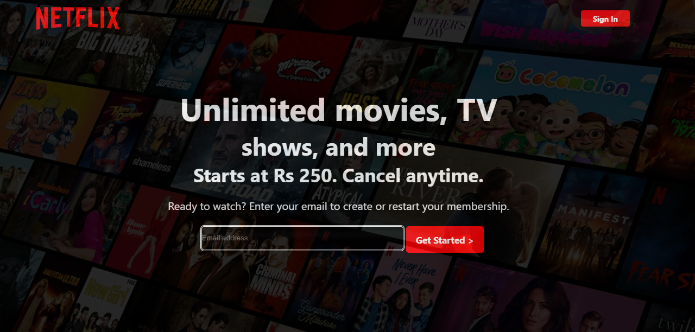

🎬 Netflix Pakistan Clone

A responsive Netflix Pakistan landing page clone built with HTML5 and CSS3.
This project recreates the visual structure of Netflix's homepage, including the hero section, trending movies, membership reasons, FAQ section, and footer.

«⚠️ Disclaimer: This project is created for educational and practice purposes only. It is not affiliated with or endorsed by Netflix.»

---

📸 Preview

  

---

✨ Features

- 🎬 Netflix-inspired landing page
- 🌑 Dark-themed interface
- 🖼️ Full-screen hero background section
- 🔥 Trending Now movie section
- ➡️ Horizontal scrolling movie cards
- 🎯 Hover effects on movie cards
- ⭐ More Reasons to Join section
- 📺 Watch on TV information
- 📥 Download shows information
- 🌍 Watch everywhere information
- 👨‍👩‍👧 Kids profiles information
- ❓ Frequently Asked Questions section
- ➕ Interactive-looking FAQ plus buttons
- 📱 Responsive layout using CSS media queries
- 🔐 Sign In button
- 📧 Email input with Get Started button
- 🌐 Footer navigation section
- ⚡ CSS transitions and visual effects

---

🛠️ Technologies Used

Technology| Usage
HTML5| Website structure and content
CSS3| Styling, layout, responsiveness and animations
Flexbox| Page and component layouts
CSS Grid| Footer layout
Media Queries| Responsive design
CSS Transitions| Hover effects
Linear Gradients| Background and visual effects
SVG / Images| Logos, icons and movie posters

---

📂 Project Structure

Netflix-Clone/
│
├── index.html
├── style.css
│
├── images/
│   ├── logo.svg
│   └── background.jpg
│
├── scroll images/
│   ├── images.jpeg
│   ├── movie imge.avif
│   └── ...
│
├── more reasons to join images/
│   ├── arrow-down-3.svg
│   ├── 7855549.png
│   └── ...
│
└── plus-svgrepo-com (4).svg

---

🎨 Main Sections

🏠 Hero Section

The landing section contains:

- Netflix logo
- Sign In button
- Main heading
- Subscription information
- Email input
- Get Started button
- Full-screen background image

The hero section uses a dark overlay to create a Netflix-style cinematic appearance.

---

🔥 Trending Now

A horizontally scrollable section displaying movie/show cards.

Each card includes:

- Movie poster
- Ranking number
- Hover animation
- Drop-shadow effect

The cards automatically adapt to smaller screen sizes through responsive CSS.

---

⭐ More Reasons to Join

Four information cards explain different Netflix benefits:

1. Enjoy on your TV
2. Download your shows to watch offline
3. Watch everywhere
4. Create profiles for kids

Each card uses a dark gradient background with an illustrative icon.

---

❓ Frequently Asked Questions

The FAQ section contains commonly asked questions such as:

- What is Netflix?
- How much does Netflix cost?
- Where can I watch?
- How do I cancel?
- What can I watch on Netflix?

The plus icons include a hover rotation effect.

---

🔗 Footer

The footer contains multiple navigation columns with links such as:

- FAQ
- Help Center
- Account
- Media Center
- Investor Relations
- Jobs
- Ways to Watch
- Terms of Use
- Privacy
- Cookie Preferences
- Contact Us
- Legal Notices

It also includes an English language button and Netflix Pakistan branding.

---

📱 Responsive Design

The website uses CSS media queries to adjust the layout for different screen sizes.

Desktop

- Large hero typography
- Horizontal movie cards
- Four-column information cards
- Four-column footer

Tablet

- Smaller typography
- Adjusted movie cards
- Responsive information cards

Mobile

- Stacked email form
- Smaller movie cards
- Vertically stacked reason cards
- Two-column footer
- Reduced typography
- Mobile-friendly spacing

---

🎯 What I Practiced

This project helped me practice:

- Semantic HTML structure
- CSS Flexbox
- CSS Grid
- Responsive web design
- Media queries
- Background images
- CSS gradients
- Hover effects
- Transitions
- Image positioning
- Typography
- Horizontal scrolling
- Component-like section organization
- Building a real-world website layout from scratch

---

🚀 How to Run

1. Clone the repository

git clone https://github.com/HashimMughal143/Netflix-Clone.git

2. Open the project

Navigate into the project folder:

cd Netflix-Clone

3. Run the website

Open "index.html" directly in your browser.

Or use VS Code Live Server for a better development experience.

---

📌 Future Improvements

Possible improvements for future versions:

- [ ] Add JavaScript functionality
- [ ] Make the FAQ questions expandable
- [ ] Add functional Sign In functionality
- [ ] Connect the email form to a backend
- [ ] Add real movie data
- [ ] Add movie detail pages
- [ ] Add a working search feature
- [ ] Improve accessibility
- [ ] Add a functional language selector
- [ ] Deploy the project online

---

👨‍💻 Author

Hashim Mughal

Frontend Developer | HTML • CSS • JavaScript • React

I'm continuously building projects to improve my frontend development skills and create better, more responsive web experiences.

---

⭐ Support

If you found this project useful or interesting, consider giving the repository a ⭐ on GitHub.

---

📄 License

This project is intended for educational and portfolio purposes.

Netflix and its associated branding, logos, and content belong to their respective owners.
